# Database Schema Diagram

## Entity Relationship Diagram

```mermaid
erDiagram
    users ||--o{ sessions : creates
    users ||--o{ audit_logs : performs
    users ||--o{ electronic_signatures : signs
    users ||--o{ export_logs : exports
    users ||--o{ role_change_logs : "subject of"
    users ||--o{ role_change_logs : "changed by"
    teams ||--o{ users : contains
    teams ||--o{ sessions : owns
    roles ||--o{ users : "assigned to"
    features ||--o{ sessions : "used in"
    electronic_signatures ||--o{ export_logs : "signs"
    audit_logs ||--o{ electronic_signatures : "linked to"

    users {
        int id PK
        string username UK
        string email UK
        string password_hash
        string first_name
        string last_name
        string role FK
        int team_id FK
        boolean is_active
        boolean is_locked
        int failed_login_attempts
        timestamp last_login
        timestamp created_at
        timestamp updated_at
    }

    teams {
        int id PK
        string name UK
        text description
        int manager_id FK
        boolean is_active
        timestamp created_at
        timestamp updated_at
    }

    sessions {
        int id PK
        string session_id UK
        int user_id FK
        int team_id FK
        string project_id
        string project_name
        string session_type
        timestamp start_time
        timestamp end_time
        int duration_seconds
        jsonb agents_used
        jsonb features_used
        int token_usage_input
        int token_usage_output
        int token_usage_total
        jsonb outputs_generated
        string status
        text error_message
        jsonb metadata
        timestamp created_at
        timestamp updated_at
    }

    features {
        int id PK
        string feature_code UK
        string feature_name
        string category
        text description
        boolean is_active
        boolean is_deprecated
        timestamp deprecated_at
        int replacement_feature_id FK
        timestamp created_at
        timestamp updated_at
    }

    roles {
        int id PK
        string role_name UK
        text role_description
        jsonb permissions
        int hierarchy_level UK
        boolean is_active
        timestamp created_at
        timestamp updated_at
    }

    audit_logs {
        bigint id PK
        timestamp timestamp
        int user_id FK
        string username
        string action_type
        string resource_type
        string resource_id
        text action_description
        string http_method
        string endpoint
        jsonb request_body
        int response_status
        jsonb old_values
        jsonb new_values
        text reason_for_change
        string ip_address
        text user_agent
        string session_id
        int duration_ms
        boolean is_success
        text error_message
        string compliance_category
        timestamp created_at
    }

    electronic_signatures {
        int id PK
        string signature_id UK
        int user_id FK
        string username
        string full_name
        string signature_meaning
        string signature_text
        boolean password_verified
        string action_type
        string resource_type
        string resource_id
        string data_hash
        string hash_algorithm
        timestamp timestamp
        string ip_address
        text user_agent
        text reason
        bigint audit_log_id FK
        int export_log_id FK
        boolean is_valid
        timestamp invalidated_at
        int invalidated_by FK
        text invalidation_reason
        timestamp created_at
    }

    export_logs {
        int id PK
        string export_id UK
        int user_id FK
        string username
        string export_type
        string export_format
        string data_type
        jsonb filters_applied
        int record_count
        bigint file_size_bytes
        string file_path
        string file_hash
        boolean is_signed
        int signature_id FK
        string signature_meaning
        timestamp timestamp
        int duration_ms
        string ip_address
        text user_agent
        string status
        text error_message
        timestamp created_at
    }

    role_change_logs {
        int id PK
        int user_id FK
        string old_role
        string new_role
        int changed_by FK
        text reason
        timestamp effective_date
        timestamp expiry_date
        boolean approval_required
        int approved_by FK
        timestamp approved_at
        timestamp timestamp
        timestamp created_at
    }

    migrations {
        int id PK
        string name
        string filename
        string checksum
        timestamp applied_at
        string applied_by
        int execution_time_ms
        string status
    }
```

## Table Descriptions

### Core Tables

- **users**: User accounts for authentication and authorization
- **teams**: Organizational grouping of users
- **sessions**: Session analytics data (core business data)
- **features**: Product feature catalog
- **roles**: RBAC role definitions with permissions

### GxP Compliance Tables

- **audit_logs**: Comprehensive audit trail (ALCOA+ compliant)
- **electronic_signatures**: Electronic signatures (21 CFR Part 11)
- **export_logs**: Data export tracking
- **role_change_logs**: Access control change tracking

### System Tables

- **migrations**: Database migration tracking

## Indexes Summary

### High-Performance Indexes
- All primary keys (BTREE)
- Foreign key columns (BTREE)
- Timestamp columns for audit queries (BTREE DESC)

### JSONB Indexes
- GIN indexes on: agents_used, features_used, permissions, filters_applied
- Enable efficient JSON querying and filtering

### Composite Indexes
- (user_id, timestamp) for user activity queries
- (resource_type, resource_id, timestamp) for resource audit trails

## GxP Compliance Features

### ALCOA+ Implementation
- **Attributable**: user_id and username in all audit tables
- **Legible**: Clear column names and documentation
- **Contemporaneous**: Automatic timestamps (NOW())
- **Original**: old_values/new_values preservation
- **Accurate**: Input validation via constraints
- **Complete**: Comprehensive metadata capture
- **Consistent**: Database constraints and triggers
- **Enduring**: Persistent storage with backups
- **Available**: Indexed for fast retrieval

### 21 CFR Part 11 Compliance
- Electronic signature capture with meaning
- Data integrity hashing (SHA256)
- User authentication verification
- Non-repudiation controls
- Signature audit trail linkage
